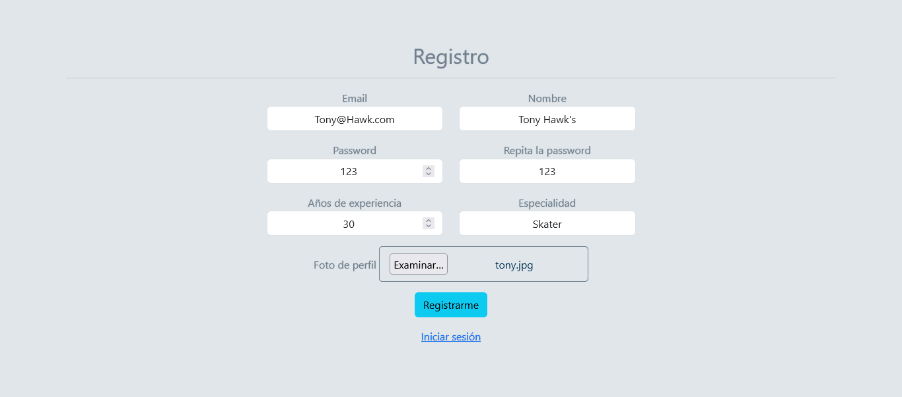
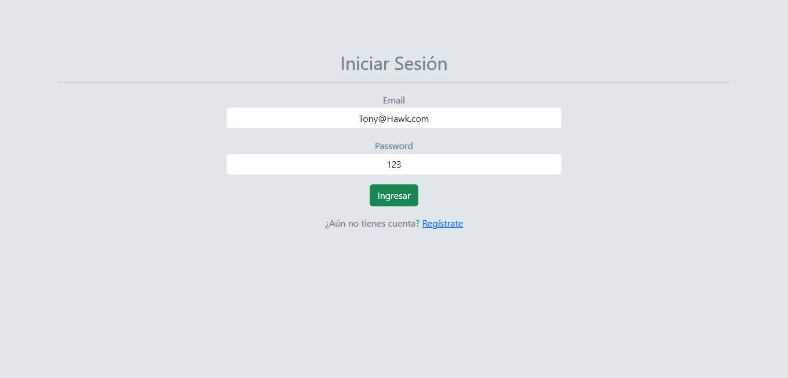
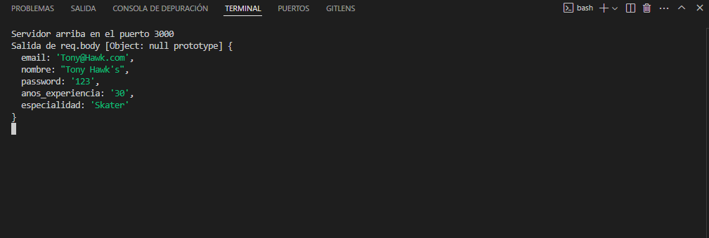

# Sistema de Gestión Empresarial

## Descripción del proyecto

La Municipalidad de Santiago, ha organizado una competencia de Skate para impulsar el nivel
deportivo de los jóvenes que desean representar a Chile en los X Games del próximo año, y
han iniciado con la gestión para desarrollar la plataforma web en la que los participantes se
podrán registrar y revisar el estado de su solicitud
En esta prueba deberás ocupar todos tus conocimientos para desarrollar un sistema que
involucre tus habilidades como Full Stack Developer, consolidando tus competencias en el
frontend y backend.
Las tecnologías y herramientas que deberás ocupar son las siguientes:
- Express
- Handlebars
- PostgreSQL
- JWT
- Express-fileupload

## Consideraciones

-  El sistema debe permitir registrar nuevos participantes.
-  Se debe crear una vista para que los participantes puedan iniciar sesión con su correo
y contraseña.
-  Luego de iniciar la sesión, los participantes deberán poder modificar sus datos,
exceptuando el correo electrónico y su foto. Esta vista debe estar protegida con JWT
y los datos que se utilicen en la plantilla deben ser extraídos del token.
-  La vista correspondiente a la ruta raíz debe mostrar todos los participantes
registrados y su estado de revisión.
-  La vista del administrador debe mostrar los participantes registrados y permitir
aprobarlos para cambiar su estado.

## Comenzando 🚀

_Estas instrucciones te permitirán obtener una copia del proyecto en funcionamiento en tu máquina local para propósitos de desarrollo y pruebas._

Mira **Deployment** para conocer como desplegar el proyecto.


### Pre-requisitos 📋

_Que cosas necesitas para instalar el software y como instalarlas_

```
Visual Studio Code, PyCharm
```
```
Python 3
```
```
Git, Github
```
```
variables de entorno para python
```
### Instalación 🔧

```
Importar proyecto al IDE de preferencia para ejecutar.
```

## Deployment 📦

Realizar un fork o clon del proyecto, importar al IDE de preferencia, para ejecutar en consola realizar el build (empaquetado) de la aplicación.
## Instrucciones para Cargar la Base de Datos 

Se debe persistir la información de los usuarios en PostgreSQL, por lo que deberás usar las
siguientes sentencias SQL para la creación de la base de datos y la tabla de participantes.

## Instrucciones para crear la base de datos


```bash
sql
```

```bash
CREATE DATABASE skatepark;

CREATE TABLE skaters (id SERIAL, email VARCHAR(50) NOT NULL, nombre
VARCHAR(25) NOT NULL, password VARCHAR(25) NOT NULL, anos_experiencia
INT NOT NULL, especialidad VARCHAR(50) NOT NULL, foto VARCHAR(255) NOT
NULL, estado BOOLEAN NOT NULL);

```

## Requerimientos
1. Crear una API REST con el Framework Express (3 Puntos)
2. Servir contenido dinámico con express-handlebars (3 Puntos)
3. Ofrecer la funcionalidad Upload File con express-fileupload (2 Puntos)
4. Implementar seguridad y restricción de recursos o contenido con JWT (2 Puntos)

## Capturas de Pantalla del Proyecto terminado
Registro



Login




Terminal



## Construido con 🛠️

* [Python](https://www.python.org/downloads/)
* [Visual Studio Code](https://code.visualstudio.com/)
* [Git](https://git-scm.com/)
* [GitHub](https://github.com/)


## Versionado 📌

## Autores ✒️

https://github.com/victorpenafiel

## Licencia 📄

Ningún derecho reservado.  [Creative Commons Atribución/Reconocimiento 4.0 ](https://creativecommons.org/licenses/by/4.0/deed.es).

Este proyecto está bajo la Licencia - mira el archivo [LICENSE.md](LICENSE.md) para detalles